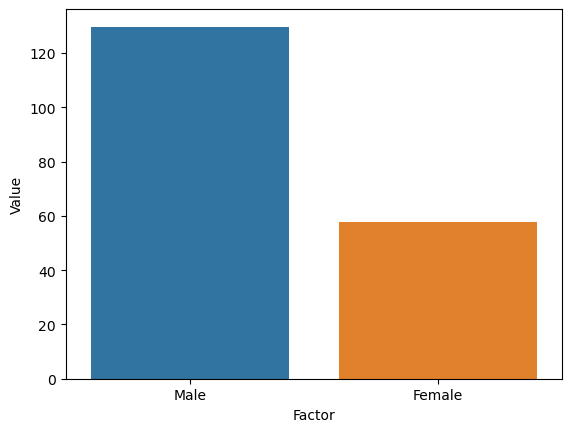
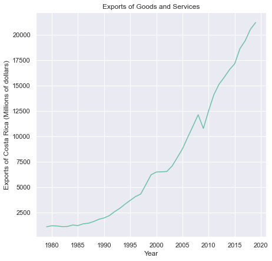
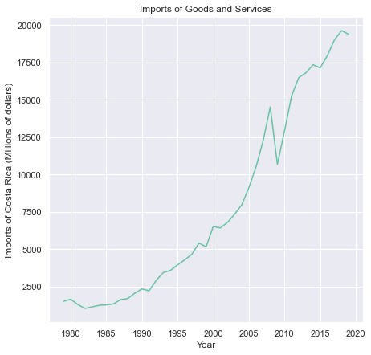
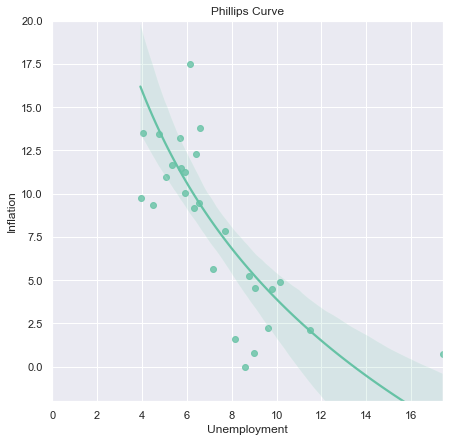

# WorldBank Data Analysis Costa Rica


## Description

* The first part (`part2.ipynb`) is using the API from the World Bank. It has several plots, including Employeer Comparison between males and females. Also plenty more plots from merchandise exports and imports.

* The second part of the project is in file `part1.ipynb`. This part is using a csv file
Contains two linear plots (imports and exports) and one scatterplot with the Phillips curve (Economic's Theory).


## Employment Male/Female

Next graph simply shows the amount of employment amount male and female (up to )



```python
female = merged_employment_total[f'{female_employeer_name_ind}'].sum()
male = merged_employment_total[f'{male_employeer_name_ind}'].sum()
df = pd.DataFrame({'Factor': ['Male', 'Female'],'Value': [male, female]})
sns.barplot(x='Factor', y='Value', data=df)
```


```python
female = merged_employment_total[f'{female_employeer_name_ind}'].tolist()[::-1]
male = merged_employment_total[f'{male_employeer_name_ind}'].tolist()[::-1]
year = merged_employment_total[f'year'].tolist()[::-1]

df_ = df.melt(id_vars=['Year'],value_vars=['Male', 'Female'], var_name=['Gender'])

sns.barplot(x ="Year", y = 'value', data = df_, hue = "Gender")
plt.ylabel('Female/Male')
plt.xlabel('Year')
plt.title('Male and Female Employeer Comparison')
sns.set(rc = {'figure.figsize':(20,10)})
sns.set_theme(style="whitegrid")
```


```python
ax = sns.boxplot(x="Gender", y="value", data=df_)
sns.set(rc = {'figure.figsize':(10,10)})
plt.ylabel('Sample Values distribution')
plt.title('Male and Female Employeer Comparison')
ax = sns.swarmplot(x="Gender", y="value", data=df_, color=".25")
sns.set_theme(style="whitegrid")
```

# Exports and Imports

## Exports

```python
q = pd.read_csv('cr.csv')
colnam = q.iloc[4]
q.columns = colnam
q = q[5:]
colnam = q.iloc[4]
q = q.drop(['Country Name','Country Code'], axis=1).reset_index(drop=True)  # remmueve columnas y pone el indedice en zero
```

```python
cond = q['Indicator Name'] == 'Exports of goods and services (BoP, current US$)'
exports_goods_services = q[cond]
exports_goods_services = exports_goods_services.dropna(axis='columns')
exports_goods_services = exports_goods_services.iloc[0,4:]
exports_goods_services = exports_goods_services.astype('int64')
```

```python
plt.figure(figsize=(7,7))
sns.lineplot(data=exports_goods_services/1000000)
sns.set(style='whitegrid')
sns.set_style('darkgrid')
#sns.set(font_scale = 1)
sns.set_palette('Set2')
plt.ylabel('Exports of Costa Rica (Millions of dollars)')
plt.xlabel('Year')
plt.title('Exports of Goods and Services')
```



## Imports

```python
cond = q['Indicator Name'] == 'Exports of goods and services (BoP, current US$)'
exports_goods_services = q[cond]
exports_goods_services = exports_goods_services.dropna(axis='columns')
```

```python
cond = q['Indicator Name'] == 'Imports of goods and services (BoP, current US$)'
cond
imports_goods_services = q[cond]
imports_goods_services = imports_goods_services.dropna(axis='columns')

imports_goods_services = imports_goods_services.iloc[0,4:]
imports_goods_services = imports_goods_services.astype('int64')
```


```python
plt.figure(figsize=(7,7))
sns.lineplot(data=imports_goods_services/1000000)
sns.set(style='whitegrid')
sns.set_style('darkgrid')
#sns.set(font_scale = 1)
sns.set_palette('Set2')
plt.ylabel('Imports of Costa Rica (Millions of dollars)')
plt.xlabel('Year')
plt.title('Imports of Goods and Services')
```



## Inflation and employment

```python
unemployment = q['Indicator Name'] == 'Unemployment, total (% of total labor force) (national estimate)'
unemployment = q[unemployment]
unemployment = unemployment.iloc[0,4:]
unemployment = unemployment.astype('float64')
unemployment_filter = unemployment.index[:] > 1991
unemployment = unemployment[unemployment_filter]
```

```python
inflation = q['Indicator Name'] == 'Inflation, consumer prices (annual %)'
inflation = q[inflation]
inflation = inflation.iloc[0,4:]
inflation = inflation.astype('float64')
inflation_filter = inflation.index[:] > 1991
inflation = inflation[inflation_filter]
```

```python
plt.figure(figsize=(7,7))
sns.set_style('darkgrid')
#sns.scatterplot(x=unemployment, y=inflation)
sns.regplot(x=unemployment, y=inflation, logx=True)
plt.xlim(0, None)
plt.ylim(-2,20)
plt.ylabel('Inflation')
plt.xlabel('Unemployment')
plt.title('Phillips Curve')
```
